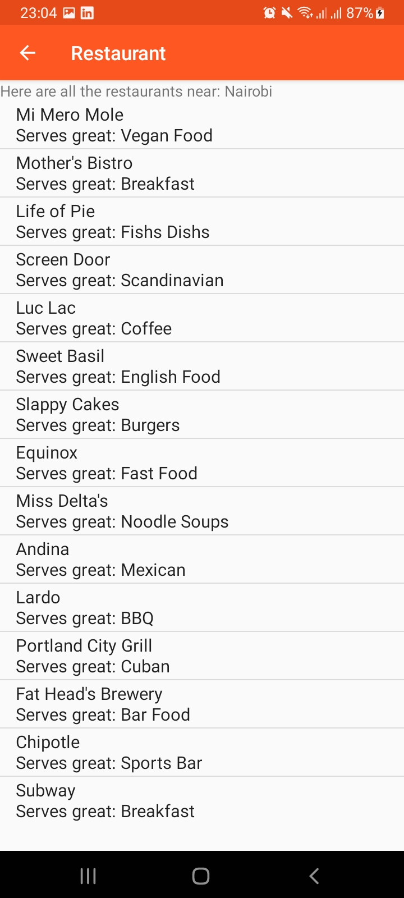

# Restaurant
An app where users can see restaurants near them
## Accessing the app
* Clone repository in terminal.
* Open project in Android Studio.
* Run emulator and there you have the application in our emulator!

## Screenshots

